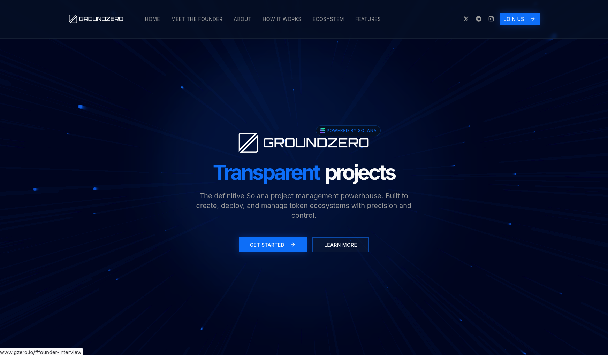

### About me 👨‍💻

- 🌱 Piotr Skierka, 19
- 👨‍🎓 I am a CS sophomore at Politechnika Gdańska (check out my repository "pg" to find out about the projects realised during my enrollment!)

### 🌐 Featured Project — [gzero.io](https://gzero.io)

  

**[gzero.io](https://gzero.io)** — an interactive frontpage built for **GroundZero**, a Solana-based startup.  
The goal: to create an elegant, on-brand, and visually striking way to present project information online.

**✨ Highlights**
- 🎨 Designed and developed fully from scratch  
- ⚡ Optimized for responsiveness  
- 🧩 Integrates smooth animations and modern web principles  
- 🪙 Built to align with GroundZero’s brandlines

**Tech Stack:** React · Tailwind CSS · Node.js

 

### Tech Stack 🖥️

✨ **Core Expertise** ✨  

  
   
  

🚀 **Full Stack Toolkit**  
<table border="0" cellspacing="10" cellpadding="5" style="border-collapse: collapse; border: none;">
  <tr style="border: none;">
    <td align="center" style="border: none;">
      
    </td>
    <td align="center" style="border: none;">
      
    </td>
    <td align="center" style="border: none;">
      
    </td>
  </tr>
  <tr style="border: none;">
    <td align="center" style="border: none;">
      
    </td>
    <td align="center" style="border: none;">
      
    </td>
    <td align="center" style="border: none;">
      
    </td>
  </tr>
  <tr style="border: none;">
    <td align="center" style="border: none;">
      
    </td>
    <td align="center" style="border: none;">
      
    </td>
    <td align="center" style="border: none;">
      
    </td>
  </tr>
  <tr style="border: none;">
    <td align="center" style="border: none;">
      
    </td>
    <td align="center" style="border: none;">
      
    </td>
  </tr>
</table>

 

### My LeetCode stats 📈

