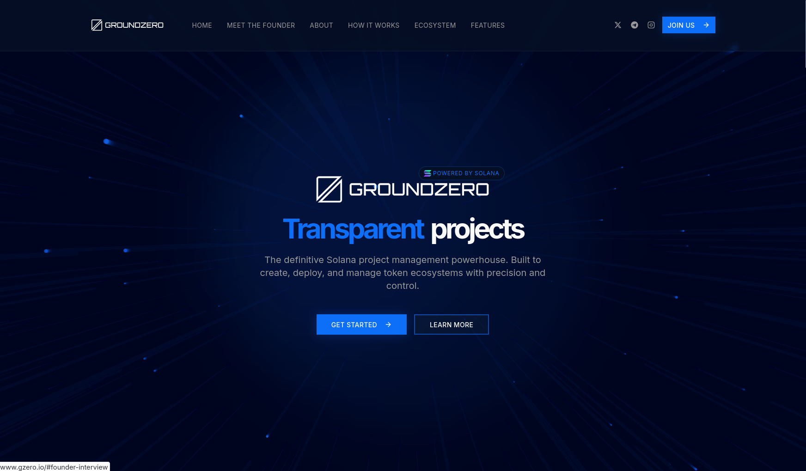

### About me 👨‍💻

-  Piotr Skierka, 19
-  CS undergrad at Politechnika Gdańska

## My skills

  <b> Main Stack </b>
  

  
  <b> Had contact with / learning </b>
  
  
  

### 🌐 Featured Project — [gzero.io](https://gzero.io)

  

**[gzero.io](https://gzero.io)** — an interactive frontpage built for **GroundZero**, a Solana-based startup.  
The goal: to create an elegant, on-brand, and visually striking way to present project information online.

**✨ Highlights**
-  Designed and developed fully from scratch  
-  Optimized for responsiveness  
-  Integrates smooth animations and modern web principles  
-  Built to align with GroundZero’s brandlines

**Tech Stack:** React · Tailwind CSS · Node.js

 

### My LeetCode stats 📈

